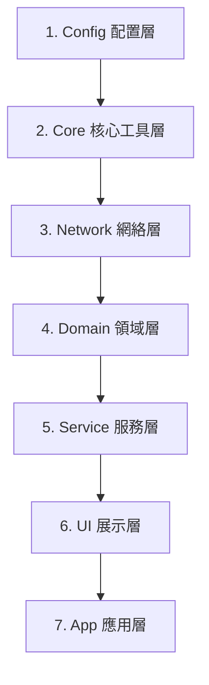

# iOS Scriptable 股票 Widget **v3.2.0** 規格文件

**版本**: 3.2.0-MA-Pill  
**平台**: iOS Scriptable v1.7+  
**發布日期**: 2026-08-19  
**GitHub**: [https://github.com/hin88188/ios-scriptable-stock-widget/](https://github.com/hin88188/ios-scriptable-stock-widget/)

---

## 📋 版本更新總覽

| 版本 | 日期 | 主要特色 | 文件同步 |
|------|------|----------|----------|
| **3.2.0** | 2026-08-19 | **MA 均線三段膠囊燈號重構** (20/50/200日站位 + 多空排列膠囊框) | ✅ |
| 3.1.0 | 2025-12-01 | **RSI 修正** (Wilder's Smoothing 算法/數據範圍修正) | ✅ |
| 3.0.0 | 2025-12-01 | **架構重構** (分層架構/OOP/統一數據獲取/並發優化) | ✅ |
| 2.10.0 | 2025-11-28 | RSI 相對強弱指標 | ✅ |
| 2.9.0 | 2025-11-26 | MA 均線完整實作 | ✅ |
| 2.8.0 | 2025-11-19 | 分時走勢隨機模式 | ✅ |
| 2.7.0 | 2025-11-16 | 分時走勢圖 Widget | ✅ |

---

## 🎯 產品架構 (v3.0.0)

採用 **七層架構 (Layered Architecture)** 設計，確保代碼的高內聚低耦合：



### **層級職責**

1.  **Config**: 定義全域常數 (`MARKET`, `COLORS`)、API 端點、快取策略。
2.  **Core**: 通用工具 (`Logger`, `Utils`, `ColorTheme`)，無業務邏輯。
3.  **Network**: 處理 HTTP 請求 (`HttpClient`)、重試機制、並發控制 (`LbkrsApi`)。
4.  **Domain**: 純粹的數據模型 (`Stock`) 與算法 (`TechnicalIndicators`)。
5.  **Service**: 業務邏輯核心 (`StockService`, `CacheService`)，協調數據獲取與計算。
6.  **UI**: 視圖構建 (`WidgetBuilder`) 與繪圖邏輯 (`Painters`)。
7.  **App**: 程式入口，負責生命週期管理與錯誤處理。

---

## 🏗️ 核心組件 (v3.0.0)

### **1. 統一數據獲取 (Unified Fetching)**
`StockService.enrichStocks(stocks, columns)` 是數據處理的核心樞紐：
- **智能判斷**: 根據 `columns` 可見性自動決定是否需要抓取歷史數據。
- **策略選擇**:
  - 需要 MA/RSI → 抓取 201 天歷史數據 (並發)。
  - 僅需 Candle → 抓取 1 天歷史數據 (或使用 Detail 數據)。
- **並發執行**: 使用 `Promise.all` 並發處理所有股票的數據補充。

### **2. 現代化網絡層** `HttpClient`
- **並發控制**: 透過 `MAX_CONCURRENT_REQUESTS` (預設 20) 限制同時發出的請求數，避免觸發 API 限流。
- **指數退避**: 請求失敗時自動重試 (`REQUEST_RETRY_COUNT`=3)，等待時間指數增長。
- **請求隊列**: 內部維護 Queue，確保請求有序執行。

### **3. 繪圖邏輯分離** `Painters`
將繪圖代碼從 UI 建構中抽離，專注於 `DrawContext` 操作：
- `drawCandle(stack, candle)`: 繪製 K 線 (實體 + 影線)。
- `drawMA(stack, maData)`: 繪製 MA 三段膠囊燈號 (20/50/200 站位色塊與多空排列微光外框)。
- `drawRSI(stack, rsi)`: 繪製 RSI 數值與趨勢箭頭。

### **4. 通用快取服務** `CacheService`
- **統一存儲**: 所有快取存為 `lbkrs_v3_{key}.json`。
- **TTL 控制**: 讀取時檢查 `ts` 時間戳，過期自動失效 (`CACHE_DURATION` / `HISTORY_CACHE_DURATION`)。
- **數據隔離**: 支援 Ranking、Watchlist、History 等多種數據類型的快取。

---

## 🔌 配置系統 (v3.0.0)

### **Widget.js**
```javascript
const CONFIG = {
  // ... 基礎配置
  CACHE_DURATION: 1,          // 主列表快取 (分)
  HISTORY_CACHE_DURATION: 1,  // 歷史數據快取 (分) - v3.0.0 改為 1 分鐘
  
  // 效能配置
  MAX_CONCURRENT_REQUESTS: 20, // 最大並發數 - v3.0.0 提升至 20
  REQUEST_RETRY_COUNT: 3,
  
  // ... MA/RSI/KLINE 配置保持不變
}
```

### **MiniTimesharesSparklineWidget.js**（分時走勢 Medium）
```javascript
const CONFIG = {
  RANDOM: 'rank',       // 'none' | 'cus' | 'rank'
  RANK_TOP_N: 50,       // 排行隨機範圍
  symbol: 'NVDA,AAPL',  // 預設代碼或列表
  period: 'all',        // 1d/5d/1m/6m/all
  chart: { w: 520, h: 120 }
}
```

---

## 📈 分時走勢圖規格

### **多週期支援**
| 週期 | API | 數據點 | 特色 |
|------|-----|--------|------|
| `1d` | `timeshares?trade_session=0` | ~331/~390 | 當日分時 |
| `5d` | `mutitimeshares?merge_minute=0` | ~1500+ | 最近5交易日 |
| `1m` | `kline?line_num=24` | 24 | 月K close 線 |
| `6m` | `kline?line_num=130` | 130 | 半年K close 線 |
| `all` | Promise.allSettled() | 4圖並行 | 多圖表布局 |

### **視覺化特色**
- **UI 標籤**: 新增 `[CUS]` / `[RANK]` 顯示當前隨機模式。
- **基準虛線**: 昨收價動態虛線（MIXED模式）。
- **填充區域**: 上漲綠/下跌紅透明填充。
- **趨勢模式**: `ABOVE`/`BELOW`/`MIXED` 智能Y軸調整。

---

## ⚙️ 部署指南

### **Medium Widget**（分時走勢）
```
1. Scriptable → + → 貼上 MiniTimesharesSparklineWidget.js → 命名"分時走勢"
2. 主畫面長按 → + → Scriptable Medium → 選擇"分時走勢"
3. (可選) Widget Parameter: 
   - "NVDA" (固定)
   - "NVDA,TSLA,AAPL" (配合 RANDOM='cus' 隨機播放)
```

---

## 🧪 效能基準 (v3.0.0)

| 指標 | v2.10.0 | v3.0.0 | 備註 |
|------|---------|--------|------|
| **Large Widget** | <3.5s | **<2.5s** | 並發優化與非阻塞延遲 |
| **Medium (固定)** | <2.5s | <2.5s | 無變更 |
| **Medium (Rank)** | <3.5s | <3.5s | 無變更 |
| **All Periods** | <3s | <3s | 無變更 |
| **快取命中** | <0.5s | **<0.3s** | 結構優化 |
| **K線數據量** | 201天 | 201天 | MA + RSI 共用 |
| **API 呼叫** | N | N | 智慧並發控制 |
| **計算開銷** | - | - | 邏輯內聚 |

---

---

## 🎨 欄位配置 (v3.0.0)
 
 ### **Large Widget 欄位佈局**
 ```
 美股: industry(65) | stockCode | kline | changeRatio | currentPrice | 
       volumeRatio(28) | rsi(30) | ma(36)
 
 港股: industry(65) | stockName(65) | kline | changeRatio | currentPrice | 
       volumeRatio(28) | rsi(30) | ma(36)
 ```
 
 **v3.0.0 寬度調整**:
 - 保持 v2.10.0 的優化佈局：
   - `industry`: 65px
   - `stockName/stockDisplay`: 65px (HK/MIXED)
   - `volumeRatio`: 28px
   - `rsi`: 30px
   - `ma`: 動態寬度 (`DAYS.length * 12`)
 
 ---
 
 **文件版本**: v3.2.0-MA-Pill  
 **最後更新**: 2026-08-19  
 **狀態**: ✅ 與原始碼 **100% 同步**